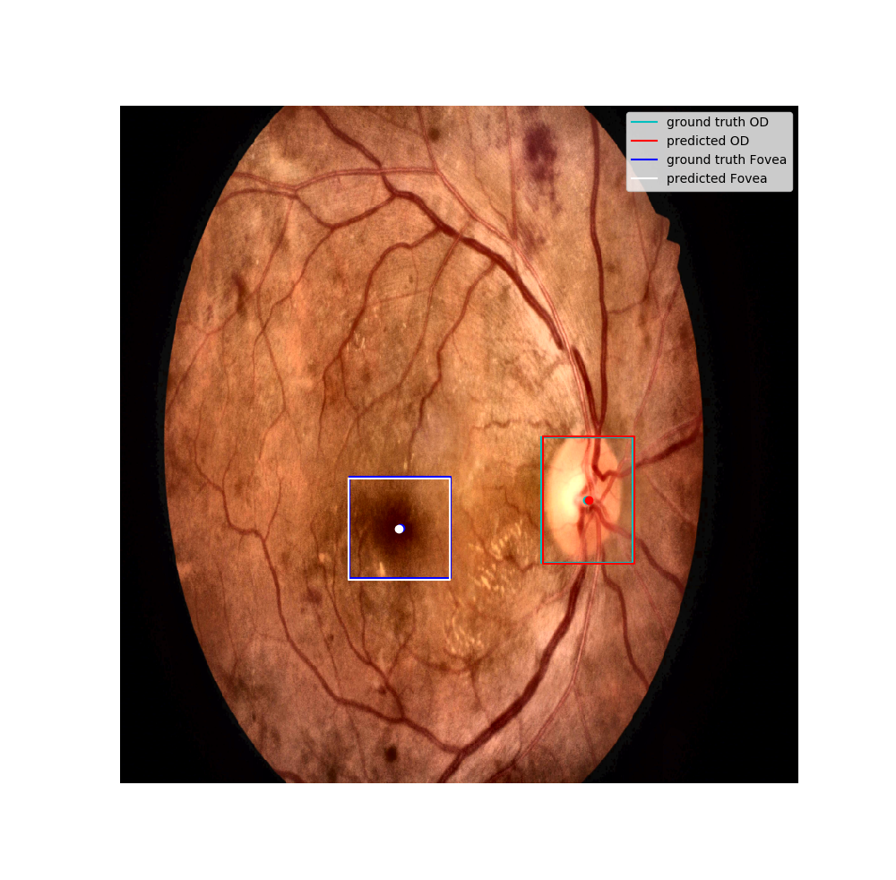

## Dependencies

We use PyTorch, TorchVision, PIL, and some transformations from [albumentations](https://github.com/albumentations-team/albumentations) library.
```bash
conda install -c pytorch torchvision captum
conda install -c albumentations albumentations
```

## Training
You should provide a choice for the model as argument ["RetinaNet", "FasterRCNN"]
if the choice is RetinaNet you can choose the depth of the model.
To launch the training script:
```bash
python train.py --model "FasterRCNN" --epochs 10
python train.py --model "RetinaNet" --depth 101 --epochs 10
```

## Inference
This script evaluates the performance of the model on a given dataset

```bash
python inference.py --task "evaluate" --model "RetinaNet" --depth 101 --weights "./models/RetinaNet.pth" --dataset "test"
```
This will compute the average IoU and euclidean distances for both optical disc and Fovea for the given dataset.

You can also plot a prediction for a given image by providing its index in the dataset by adding an index as integer
(be careful to not exceed the length of the dataset)

```bash
python inference.py --task "infer" --model "RetinaNet" --depth 101 --weights "./models/RetinaNet.pth" --dataset "test" --img_idx idx
```
The figure will be saved in ./figures/ folder
You will get a plot like :



## Data

The data folders are in the same format as provided in the IDRID challenge
You can find the data here (https://ieee-dataport.org/open-access/indian-diabetic-retinopathy-image-dataset-idrid).

## Weights

We provide the weights of our best performing model (RetinaNet with depth 101)
You can download it from here :
https://drive.google.com/file/d/15JVhJhNbLf5tm4I9gIJFP4Hk5Ln2UvQt/view?usp=sharing

